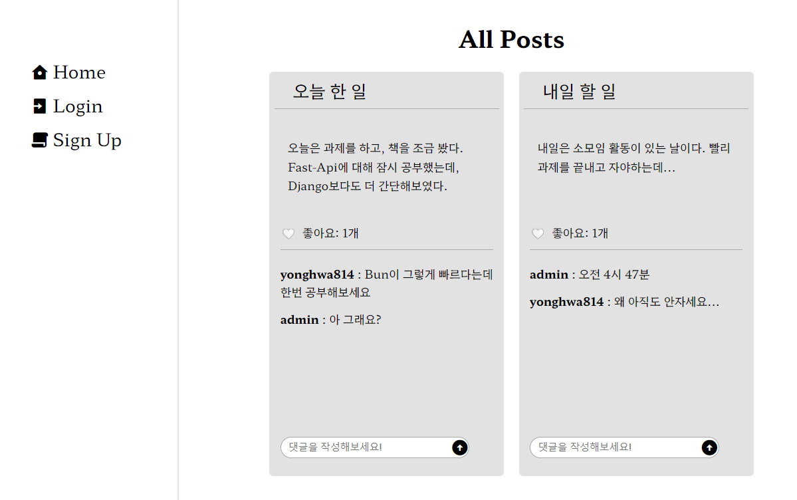
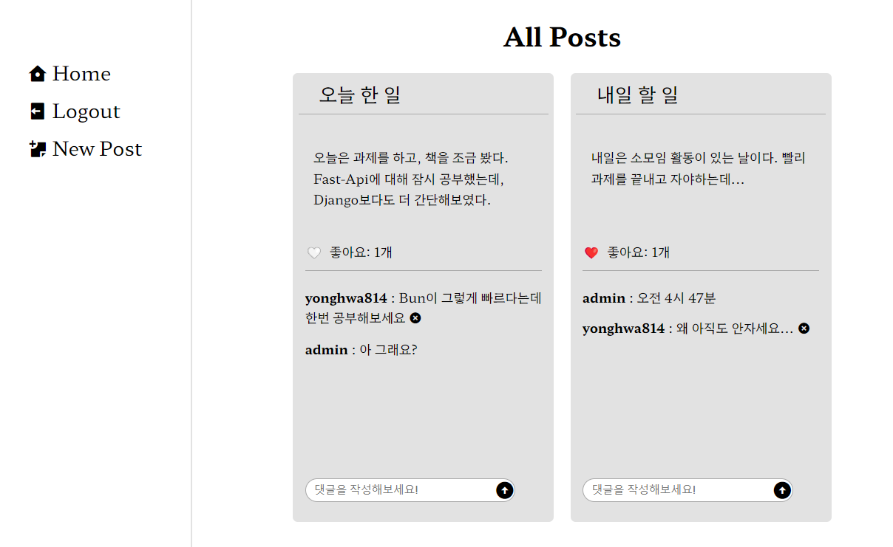
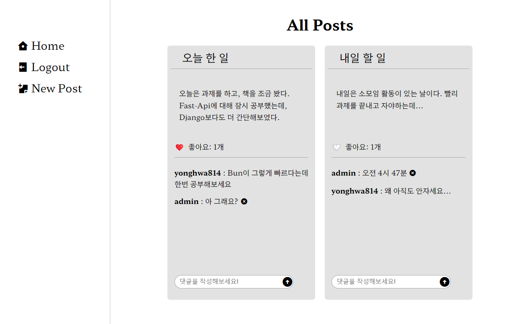

# 구현한 기능
- 댓글 작성과 삭제 (Ajax)
- 좋아요 누르기 / 좋아요 취소 (Ajax)
- 가입과 로그인
- 계정에 따른 상태차이(내가 좋아요 누른 게시글만 하트표시)
- 내가 작성한 댓글만 삭제가능

# 어려웠던 점 & 개선할 점
- Like를 구현할 때 처음에는 FK를 두 개 가진 별도의 모델로 구성해 어려움을 겪었는데, ManyToMany Field로 만들고나니 매우 간단하게 해결되어서 허무했다.
- html내에 script로 작성할 때, 분명 하단에서 정의한 onclick 함수에 대해, 자꾸 정의되지 않은 함수라며 오류를 반환해서 해결하려 했으나 원인은 찾지 못했고, JS 파일을 따로 static에 만들고 모든 코드를 옮기니 해결되었다.
- 역참조 릴레이션이 Django 모델의 매우 강력한 기능임에도 아직 능숙하게 사용하지 못하고 있다는 생각이 들었다.
- ~~처참한 Form Css~~

### 로그아웃 상태

### 로그인 상태 1

### 로그인 상태 2
